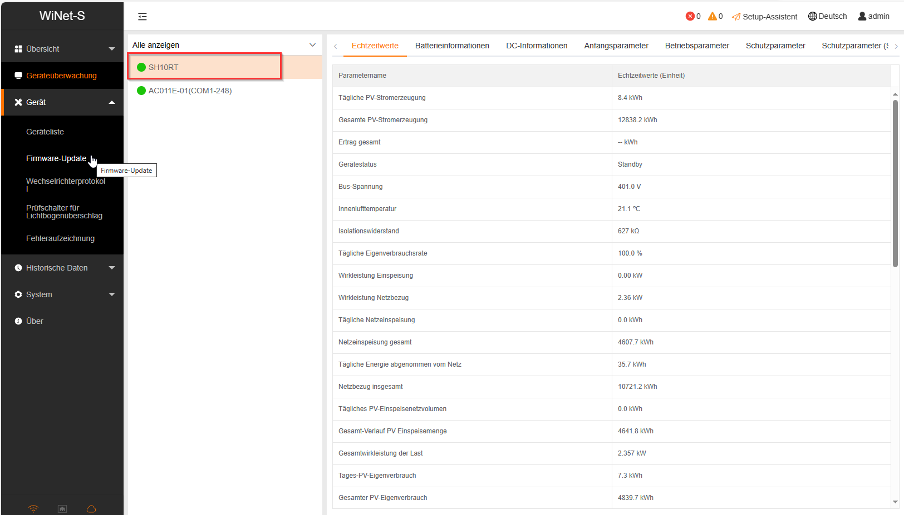
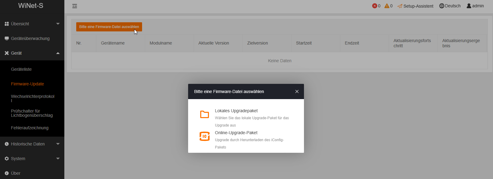
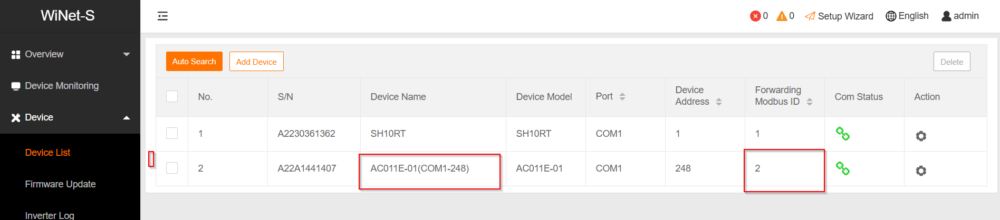
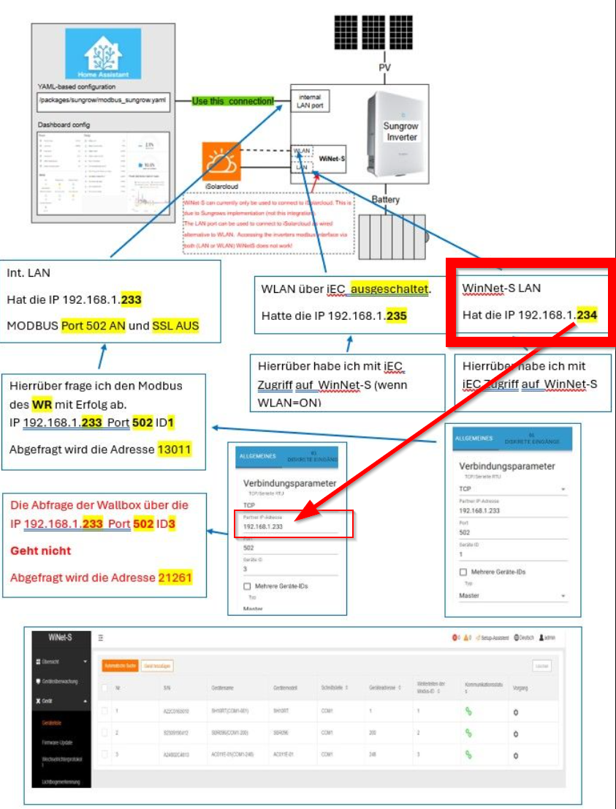

Alles zum Thema sungrow PV

### HowTo

Sungrow Wechselrichter und deren Komponenten sind über Modbus TCP abrufbar. Den Wechselrichter selbst bindet man am besten über Ethernet an, 
da der mitgelieferte WLAN Stick nicht gerade stabil läuft und auch die Daten in die Cloud sendet. Die Wallbox ist leider nur über den Wifi-Stick 
erreichbar.

### Updates

Alle updates können über den Winet-S lokal initiiert werden (z.B. mit dem Browser). Voraussetzung ist, dass man die Firmware heruntergeladen hat.
Dazu muss man sich als admin einloggen, die Komponente auswählen und die Firmware hochladen.

Firmware

### Kennwörter

#### Winet-S

Benuter: admin   
Password: pw8888   

Benutzer: user   
Password: pw1111   

### Modbus mit Inverter + Wallbox
Die Modbus Abfragen für die Wallbox können nicht über den LAN-Port des Inverters erfolgen! Die Wallbox kann nur über den Winet-S Adapter abgefragt werden!
Für die Modbus Abfragen des (SHxx-RT) verwendet ihr am besten den LAN-Port des Inverters.
Die zweite Verbindung nutzt den Winet-S Adapter (Ihr könnt dabei Wifi or LAN verwenden).
Der Abfragezyklus der Wallbox sollte nicht schneller als 10 Sekunden sein. Fragt ihr schneller ab, geht der Winet-S auf Störung. Der Inverter verträgt auch Abfrageintervalle <= 500ms.
Für jede Verbindung müsst ihr noch die richtige "Forwarding Modbus ID" setzen. Also die ID von eurem Gerät (Inverter oder Wallbox).

## Beispiel Netzwerkverbindungen 

### Ports

### Links:

https://forum.iobroker.net/topic/38441/sungrow-wr-sgh10rt-erfolgreich-mit-modbus-eingebunden

https://forum.iobroker.net/topic/73087/sungrow-wallbox-ac011e-01-erfolgreich-mit-modbus-eingebunden

[photovoltaikforum](https://www.photovoltaikforum.com/thread/166134-daten-lesen-vom-sungrow-wechselrichtern-modbus/)

[Firmware Updates](https://github.com/sungrow-firmware/firmware)

[Modbus Proxy](https://github.com/tiagocoutinho/modbus-proxy)

[iobroker und modbus](https://noegel.io/posts/2022-10-09-sungrow/)
